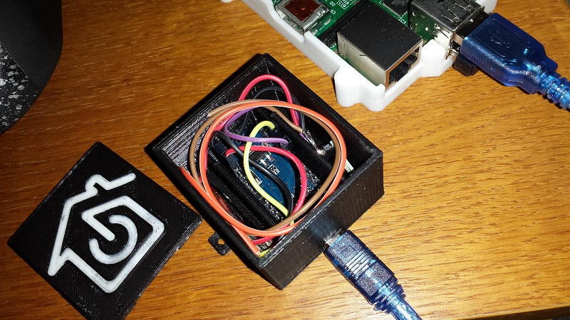

generic-rfbox
==================

This sensor probe will collect sensor data and send it by 433MHz RF
In the Sensors folder you will find a collection of Arduino sketches to make different probes for pimatic (https://github.com/pimatic/pimatic-homeduino) using the generic protocol.
The main Sketch <code>rfbox-multiprobe.ino</code> contains multiple sensors that you can enable or disable at will.
```
// Config which modules to use
boolean DHT11 = false;
boolean DS18B20 = true;
boolean ultrasonic = false;
```

The sensor will blink the internal LED and transmit the data, every sensor will send it's own data.

Update: added ds18b20 resolution check and if it's not 12 bits it will set it to 12.
> The resolution of the
temperature sensor is user-configurable to 9, 10, 11, or 12 bits, corresponding to increments of 0.5°C,
0.25°C, 0.125°C, and 0.0625°C, respectively. The default resolution at power-up is 12-bit.

Example box:
 
